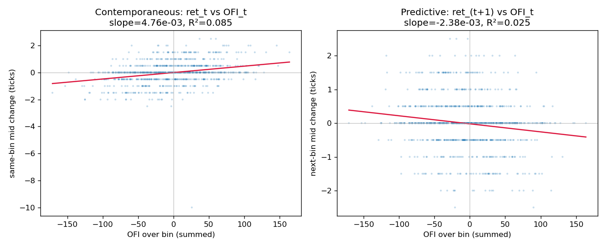

# Order Book Microstructure Engine

[](https://github.com/coreyczhang/orderbook-microstructure-engine/actions/workflows/ci.yml)

A limit order book (LOB) reconstruction and matching engine written in modern C++,
paired with a Python layer that computes an **Order Flow Imbalance (OFI)** signal and
backtests its short-horizon predictive power. Built as a portfolio project exploring
market-microstructure research on **public data only**.

See **[docs/architecture.md](docs/architecture.md)** for the component and data-flow
diagram, and **[docs/results.md](docs/results.md)** for the backtest write-up.

---

## What this is (one paragraph)

Exchanges publish a stream of order events — new limit orders, cancellations,
modifications, and executions. This project reconstructs the full limit order book from
that event stream in C++, runs a price-time-priority matching engine over it, and then
measures **order flow imbalance** — the net buying vs. selling pressure at the top of
the book — to test whether it predicts the next small move in price. The C++ core is the
systems-engineering centerpiece (cache-friendly data structures, O(1) cancels, RAII, a
randomized invariant stress test); the Python layer handles the statistical backtest.

## Roadmap

| Milestone | Scope | State |
|-----------|-------|-------|
| M1 | Core data structures: `Order`, `PriceLevel`, `OrderBook` (add/cancel/modify) + tests | ✅ done |
| M2 | Matching engine: price-time priority, partial fills, market orders, trades | ✅ done |
| M3 | Event replay + synthetic data pipeline (CSV) + ground-truth validation | ✅ done |
| M4 | OFI signal (C++) + Python regression/backtest + plots | ✅ done |
| M5 | Polish: architecture diagram, results write-up, CI | ✅ done |

**Next (post-M5):** swap in real LOBSTER data, add a transaction-cost model, extend OFI to
the top *N* levels, and (optionally) pybind11 bindings. See [docs/results.md](docs/results.md#next-steps).

## Build & test (C++)

```bash
cmake -S . -B build
cmake --build build
ctest --test-dir build --output-on-failure
```

Requires a C++17 compiler and CMake ≥ 3.14. GoogleTest is fetched automatically via
CMake `FetchContent` — no manual install needed.

## Run the pipeline

Generate a synthetic event stream, reconstruct the book, validate against ground truth,
then compute and backtest the OFI signal:

```bash
# 1. Generate 50k synthetic events + ground-truth top-of-book snapshots
python python/generate_synthetic.py --out data/events.csv \
    --truth data/events_truth_l1.csv --events 50000 --seed 42

# 2. Replay through the engine -> trades.csv, book.csv, ofi.csv
./build/engine data/events.csv --out-dir data/out

# 3. Prove the reconstructed book matches ground truth, row for row
python python/validate.py --engine-book data/out/book.csv \
    --truth data/events_truth_l1.csv

# 4. Backtest the OFI signal (chronological train/test split) and plot
python python/backtest.py --ofi data/out/ofi.csv --bin-events 50 --train-frac 0.7
python python/plots.py
```

The generator and validator use only the Python standard library. The backtest and plots
add `numpy`, `pandas`, and `matplotlib` (see `python/requirements.txt`); the OLS is
implemented directly on numpy, so no heavyweight stats package is required.

## Design notes (M1)

- **Integer prices & quantities.** Prices are stored in integer *ticks* and quantities
  in integer shares, so the book is exact — no floating-point comparison bugs.
- **`PriceLevel`** is a FIFO of orders at one price, implemented as an **intrusive
  doubly linked list + `order_id → node` hash map**, giving O(1) append and O(1)
  cancel-by-id (a plain queue would make cancellation O(n)).
- **`OrderBook`** keeps bids and asks as `std::map<Price, PriceLevel>` (sorted, so the
  best price is at `begin()`), plus an `order_id → (side, price)` index so cancels and
  modifies locate their level directly. A production-latency version would replace the
  tree with a flat array of price levels over a bounded price range — noted here as a
  deliberate follow-up.
- **RAII throughout:** node ownership lives in `std::unique_ptr`; no raw `new`/`delete`.

## Matching engine (M2)

`MatchingEngine` processes an incoming order stream against the book with strict
**price-time priority**: an aggressor sweeps the opposite side best-price-first, then
oldest-order-first within a price, at each resting order's price. It handles partial
fills (of both the aggressor and the resting order), market orders (which sweep
regardless of price and never rest their remainder), and a `modify` that re-injects a
repriced order through matching so a reprice that crosses the book executes. A resting
limit order's unfilled remainder joins the book only after all crossing liquidity is
exhausted, so the engine never leaves the book crossed.

Test rigor: alongside targeted unit tests (full/partial fills, multi-level sweeps, time
priority, out-of-sequence arrivals, market-order edge cases, repriced-modify crossings),
a **randomized stress test** runs 20,000 pseudo-random events through the engine and, after
*every* operation, asserts structural invariants (level totals equal the sum of their
orders, no lingering empty levels, id index consistency, positive quantities), a
never-crossed book, and a per-operation share-conservation identity — all with a fixed
seed so any failure reproduces.

## Data pipeline (M3)

- **`EventReplay`** parses a tick-level event CSV (`ADD` / `CANCEL` / `MODIFY` /
  `MARKET`), stable-sorts by timestamp, and feeds each event through the matching
  engine, streaming out every trade and a top-of-book snapshot per event.
- **`engine` CLI** wraps this: `engine <events.csv> --out-dir <dir>` writes `trades.csv`
  and `book.csv`.
- **`generate_synthetic.py`** produces the event stream from a Poisson arrival process
  with limit prices around a random-walking mid and occasional crossing orders. It runs
  its own **shadow book** with the same price-time rules, so cancels always reference live
  orders and its top-of-book is exact **ground truth**.
- **`validate.py`** diffs the engine's `book.csv` against that ground truth. On the
  default 50k-event stream the reconstruction matches on **all 50,000 snapshots** — a
  direct correctness check, not just a smoke test.

Real **LOBSTER** sample data will be adapted to the same event schema in a later pass; the
synthetic path keeps the whole pipeline reproducible and self-validating in the meantime.

## Order flow imbalance & methodology (M4)

**Why OFI?** The top of the book is where price is discovered. When buy-side depth grows
faster than sell-side depth — new bids arriving, asks being consumed or cancelled — the
mid tends to tick up, and vice-versa. **Order Flow Imbalance** turns that intuition into a
single signed number per book update. It is a natural, well-studied microstructure signal
because it summarizes the *net* pressure from every event type (adds, cancels, executions)
in one quantity.

**Definition.** For each update `n` with best bid `(Pb, qb)` and best ask `(Pa, qa)`,
[`OrderFlowImbalance`](include/obme/OrderFlowImbalance.hpp) computes `OFI_n = e^b_n − e^a_n`:

```
e^b_n =  qb_n · 1{Pb_n ≥ Pb_{n-1}}  −  qb_{n-1} · 1{Pb_n ≤ Pb_{n-1}}
e^a_n =  qa_n · 1{Pa_n ≤ Pa_{n-1}}  −  qa_{n-1} · 1{Pa_n ≥ Pa_{n-1}}
```

`e^b` is the net change in bid-side depth and `e^a` the net change in ask-side depth, so a
positive OFI reflects net buying pressure. This is the general formulation of
Cont, Kukanov & Stoikov, *"The Price Impact of Order Book Events"*, Journal of Financial
Econometrics 12(1), 47–88 (2014) — a public, well-known academic paper. This project
implements the **published general methodology only**, not any firm-specific variant.

The signal is computed in C++ during replay and streamed to `ofi.csv`; the Python
[`backtest.py`](python/backtest.py) bins it in event time and regresses returns on OFI with
a **chronological** (never shuffled) train/test split, and [`plots.py`](python/plots.py)
renders the figures below.

## Results (M4)

On the default synthetic stream (seed 42, 50k events, 50-event bins), full numbers and an
honest discussion of limitations are in [docs/results.md](docs/results.md). Headline:

| Regression | β | t | R² |
|------------|--:|--:|---:|
| Contemporaneous `ret_t ~ OFI_t` | +4.76e-3 | 9.6 | 0.085 |
| Predictive (in-sample) `ret_{t+1} ~ OFI_t` | −2.36e-3 | −4.0 | 0.023 |
| Predictive (out-of-sample) | — | — | 0.030 |



**Contemporaneous impact is strong and correctly signed** (positive OFI ↔ price up),
replicating the CKS direction. **Predictive power is weak and reverses sign** — this
bin's OFI slightly *negatively* forecasts next bin's move (transient impact / mean
reversion), with OOS R² ≈ 3%: statistically detectable only because N is large, and
economically marginal. On frictionless synthetic data with **no transaction costs
modeled**, that mixed/negative result is the honest and expected outcome; a suspiciously
clean predictive edge would be a red flag. The signal-following PnL curve
([docs/pnl.png](docs/pnl.png)) looks profitable *gross of costs*, but the per-bin edge is
far below a realistic half-spread — see the caveats in the results doc.

## Testing

- **59 GoogleTest cases** across the order book, matching engine, replay/parse, and OFI.
- A **randomized invariant stress test**: 20,000 pseudo-random events (fixed seed), with
  structural invariants, a never-crossed book, and per-operation share conservation
  checked after *every* operation.
- A **ground-truth reconstruction check**: the engine's rebuilt book is diffed against the
  synthetic generator's shadow book and matches on all 50,000 top-of-book snapshots.
- **CI** (GitHub Actions) builds, runs the tests, runs an end-to-end pipeline smoke test,
  and enforces `black` formatting on every push.

Build is clean under `-Wall -Wextra -Wpedantic`; no raw `new`/`delete` (RAII throughout).

## Project layout

```
include/obme/   public headers (Order, PriceLevel, OrderBook, MatchingEngine,
                EventReplay, OrderFlowImbalance, Trade)
src/            implementations + engine CLI (main.cpp)
tests/          GoogleTest suites (unit + randomized stress)
python/         generator, validator, backtest, plots, requirements.txt
docs/           architecture.md, results.md, result figures
data/           inputs & engine outputs (git-ignored; regenerated)
```

## Disclaimer

This project uses publicly available data and a clean-room implementation of a published
academic methodology. It is **not affiliated with, and does not use any code, data, or
proprietary methods from, any employer.**

## License

MIT — see [LICENSE](LICENSE).
