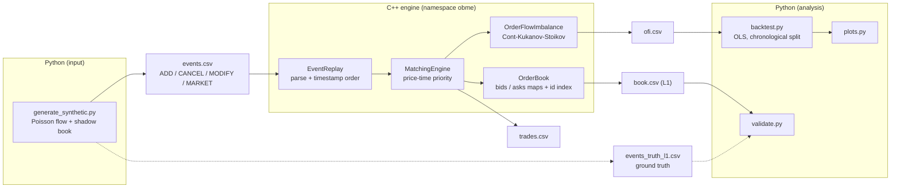

# Architecture

## Data flow



Solid arrows are the main pipeline; dashed arrows are the ground-truth validation loop
that proves the reconstruction is exact.

## ASCII view

```
 events CSV                C++ engine (obme)                     CSV out           Python
┌───────────┐   ┌───────────────────────────────────────┐   ┌────────────┐   ┌──────────────┐
│ synthetic │──▶│ EventReplay ─▶ MatchingEngine ─▶ Order- │──▶│ trades.csv │──▶│ backtest.py  │
│ / LOBSTER │   │   (ts order)      (price-time)   Book   │   │ book.csv   │   │  OLS + OOS   │
└───────────┘   │                 └▶ OrderFlowImbalance ──┼──▶│ ofi.csv    │──▶│ plots.py     │
                └───────────────────────────────────────┘   └────────────┘   └──────────────┘
```

## Components

### C++ core (`include/obme/`, `src/`)

| Component | Responsibility | Key design |
|-----------|----------------|------------|
| [`Order`](../include/obme/Order.hpp) | One order (id, side, price, qty, ts, type) | Value type; integer ticks/shares; **signed** quantity so over-fills are catchable |
| [`PriceLevel`](../include/obme/PriceLevel.hpp) | FIFO queue of orders at one price | **Intrusive doubly linked list + `id→node` map** → O(1) append, O(1) cancel; `unique_ptr` node ownership |
| [`OrderBook`](../include/obme/OrderBook.hpp) | Two-sided book, resting-order maintenance | `std::map` per side (best at `begin()`); `id→(side,price)` index; `check_invariants()` self-test |
| [`MatchingEngine`](../include/obme/MatchingEngine.hpp) | Cross incoming orders against the book | Price-time priority; partial fills; market orders; modify = in-place decrease or cancel+re-submit |
| [`EventReplay`](../include/obme/EventReplay.hpp) | Parse + replay an event stream | Header-aware CSV parse; stable-sort by timestamp; streams trades / L1 book / OFI |
| [`OrderFlowImbalance`](../include/obme/OrderFlowImbalance.hpp) | Per-event OFI from L1 updates | Cont–Kukanov–Stoikov formulation; gates on a two-sided book |
| [`engine` CLI](../src/main.cpp) | `engine <events.csv> --out-dir DIR` | Writes `trades.csv`, `book.csv`, `ofi.csv` |

### Python layer (`python/`)

| Script | Responsibility |
|--------|----------------|
| [`generate_synthetic.py`](../python/generate_synthetic.py) | Poisson order-flow generator with a shadow price-time book; emits events + ground-truth L1 |
| [`validate.py`](../python/validate.py) | Diffs engine `book.csv` against generator ground truth (row for row) |
| [`backtest.py`](../python/backtest.py) | Event-time binning; contemporaneous + forward-return OLS; chronological train/test split |
| [`plots.py`](../python/plots.py) | OFI-vs-return scatter and cumulative signal PnL vs. baseline |

## Why `std::map` (and how to go faster)

Bids/asks are `std::map<Price, PriceLevel>` for clarity: sorted, best price at `begin()`,
O(log L) level lookup. For production-grade latency with a **bounded** price range, the
standard optimization is a **flat array / ring buffer of price levels** indexed by
`(price − base)`, turning level access into O(1) array indexing and eliminating tree-node
pointer chasing and allocation. That is a deliberate future optimization, not needed for
the correctness and analysis goals here.
