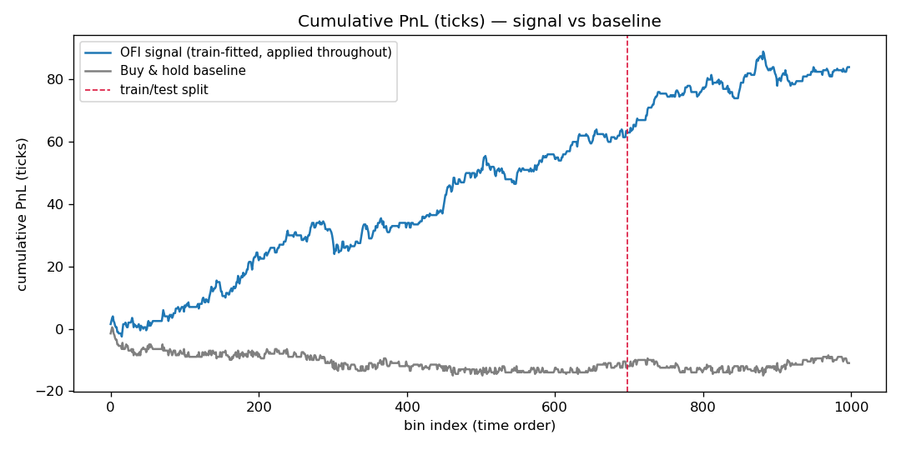

# OFI Backtest Results

**Data:** synthetic order-flow stream (`--seed 42`, 50,000 events → 17,995 trades),
reconstructed by the C++ engine. Per-event Order Flow Imbalance (OFI) computed with the
Cont–Kukanov–Stoikov formulation (see [`OrderFlowImbalance`](../include/obme/OrderFlowImbalance.hpp)).
Observations are aggregated into **event-time bins of 50 events** (998 usable bins);
returns are mid-price changes in ticks. The train/test split is **chronological** — the
first 70% of bins (698) train, the last 30% (300) test — never shuffled, so no future
information leaks into the fit.

## Regressions

| Regression | Slope β | t-stat | R² | Sample |
|------------|--------:|-------:|----:|--------|
| **Contemporaneous** `ret_t ~ OFI_t` | +4.76e-3 | 9.63 | 0.085 | 998 bins (full) |
| **Predictive (in-sample)** `ret_{t+1} ~ OFI_t` | −2.36e-3 | −4.04 | 0.023 | 698 train bins |
| **Predictive (out-of-sample)** | — | — | 0.030 | 300 test bins |


**Reading this honestly:**

- **Contemporaneous impact is real and correctly signed.** A positive OFI (net buying
  pressure at the top of book) coincides with the mid ticking *up* — the direction Cont,
  Kukanov & Stoikov document. R² ≈ 8.5% is far below the 60–70% they report on real
  equities; that gap is expected here because our signal uses only L1 (best level), the
  synthetic flow is zero-intelligence, and we bin in event time rather than clock time.
- **The predictive relationship is weak and *reverses sign*.** This bin's OFI slightly
  *negatively* predicts next bin's return (β < 0), i.e. the impact is largely **transient**
  and partially mean-reverts (a bid-ask-bounce-like effect baked into the generator).
  Out-of-sample R² is ≈ 3% — statistically non-trivial (t ≈ −4, p ≈ 5e-5) only because
  there are ~1000 bins, **not** because the effect is economically large.

## Signal PnL vs. baseline



The strategy takes `position = sign(â + b̂·OFI_t)` using coefficients fit **only on the
training set**, applied through the whole series. Because the fitted β is negative, this
is effectively a **contrarian** rule (fade the imbalance). It accumulates ~85 ticks and
keeps rising *after* the train/test boundary (dashed line), consistent with the small
positive OOS R²; buy-and-hold drifts slightly negative.

**Do not over-read this curve.** Major caveats:

1. **No transaction costs.** PnL is gross, in ticks, trading every bin. The per-bin edge
   is ~0.08 ticks; a realistic half-spread (~0.5 tick per round trip) would almost
   certainly erase it. With costs, this strategy is not obviously profitable.
2. **Synthetic, mechanical data.** The reversion the strategy exploits is a property of
   the zero-intelligence generator (transient impact + bounce), not evidence it exists,
   or has this sign, in real markets.
3. **Single asset, single seed, short horizon.** ~50 s of simulated time, one price
   process, one random seed. This is a pipeline demonstration, not a robust alpha study.
4. **L1-only, single-level OFI.** CKS and follow-ups show multi-level (deeper book) OFI
   carries additional information not captured here.

## Takeaway

The engine reconstructs the book exactly (validated to the tick against ground truth) and
the OFI signal behaves sensibly: **strong, correctly-signed contemporaneous impact; weak,
transient, economically marginal predictive power** — which, on frictionless synthetic
data with no cost model, is the honest and expected outcome. Overclaiming a clean
predictive edge here would be a red flag, not a feature.

## Reproduce

```bash
python python/generate_synthetic.py --out data/events.csv \
    --truth data/events_truth_l1.csv --events 50000 --seed 42
./build/engine data/events.csv --out-dir data/out
python python/backtest.py --ofi data/out/ofi.csv --bin-events 50 --train-frac 0.7
python python/plots.py --bins data/out/bins.csv --summary data/out/backtest_summary.json
```

## Next steps

- Swap in **LOBSTER** real sample data (same event schema) and re-run — the real test of
  whether OFI predicts, and with which sign, out of sample.
- Add a transaction-cost model (half-spread + fees) so PnL reflects tradability.
- Extend OFI to the top *N* levels and compare predictive content.
